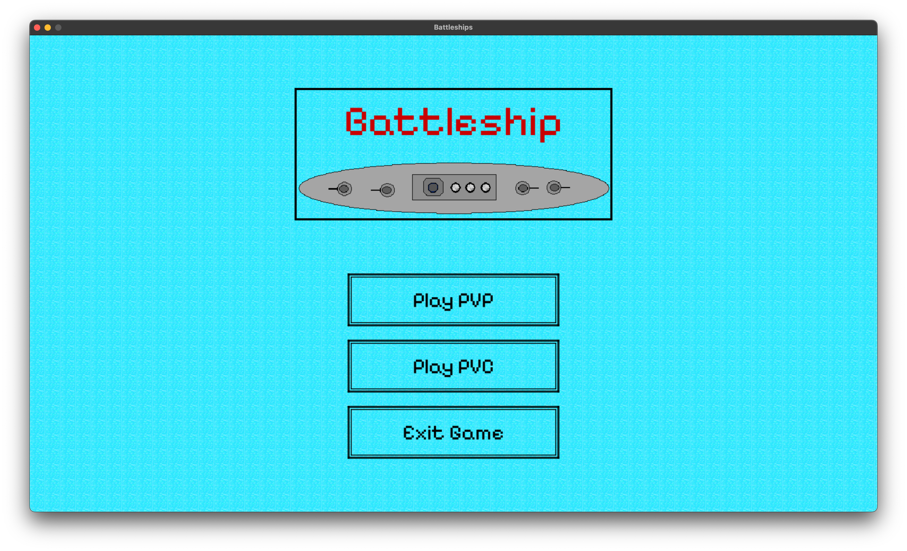
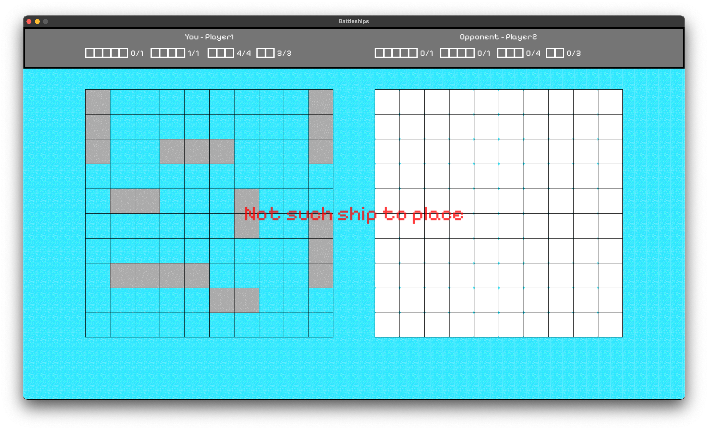
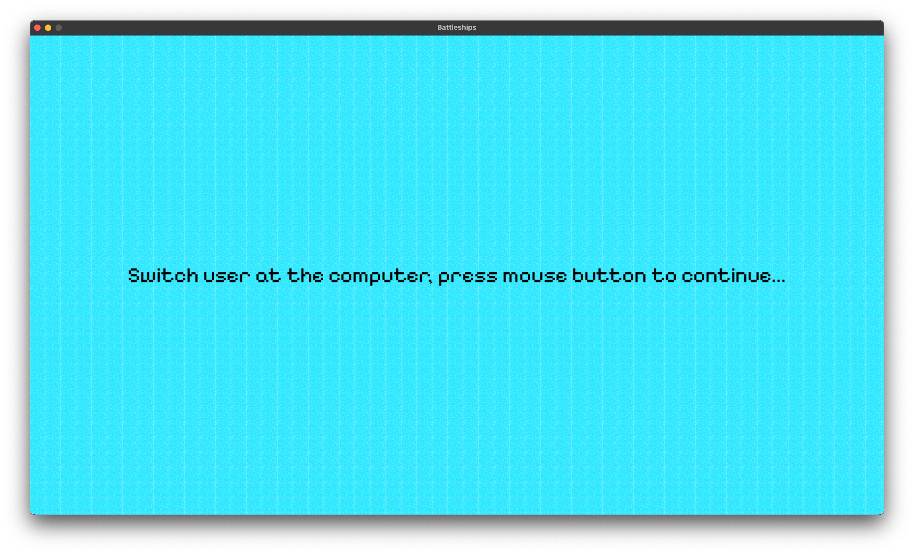

# Project Objective and Description
The project was created as a part of the first-semester assignment for Computer Science studies at the Warsaw University of Technology.

The aim of the project was to create a digital version of the Battleship game, based on well-known rules. The game has several versions, and the one implemented here is the classic version described on [Wikipedia](https://en.wikipedia.org/wiki/Battleship_(game)), where:
- After firing a shot, the user communicates "hit", "miss", or "sunk" to the opponent.
- The board size is 10x10 squares.
- The ship configuration is:
    - One carrier with a length of 5 squares
    - One battleship with a length of 4 squares
    - Four cruisers with a length of 3 squares
    - Three patrol ships with a length of 2 squares

# Game Instructions
Run the `main.py` file to start the game in a new window. The main menu will display three buttons:
  - Play PVP - start a Player vs Player game
  - Play PVC - start a Player vs Computer game
  - Exit Game - exit the game
  
After selecting any game mode, two boards and a status bar will appear. The board on the left is the current player's board (indicated on the status bar), and the board on the right is the opponent's board. The status bar displays the fleet status - how many ships of each type are deployed on the board. Initially, all values show 0 divided by the number of ships to be placed. Once a ship is shot down, the number of ships of that type decreases by 1 on the status bar.

### PVP Mode
If Player vs Player mode is selected, Player 1 starts by positioning their ships according to the specifications shown on the status bar. This is done by clicking on the starting square and releasing on the ending square of where the ship should be placed. If the player no longer has that type of ship, a prompt will notify them. Similarly, if there is a collision, they will be notified. If there are no issues, the ship will be successfully placed. After placing the ships, a prompt will appear with a "Switch user" button, and after clicking it, the game will enter the "Blackscreen phase" - a screen instructing players to switch turns at the computer. To exit this phase, click the mouse button. Now the next player positions their ships and, once finished, can proceed to attack the opponent. They fire by clicking on a square covered with a cloud. If they attempt to attack the same square again, they will be notified. After the attack, a button to switch players will appear, and the situation repeats until one player wins.

At that point, the game enters the result phase, where the winning player's name is displayed along with basic statistics:
   - Game duration
   - Number of rounds played (where a round is defined by one of the players making a shot)
   - Percentage of the winner's ship segments that were not hit
   
At the bottom, two buttons will appear:
   - Main menu - return to the start menu
   - Exit Game - exit the game

### PVC Mode
If Player vs Computer mode is selected, the game works similarly, but the switch player button does not appear.

The player starts by positioning their ships according to the specifications shown on the status bar. This is done by clicking on the starting square and releasing on the ending square of where the ship should be placed. If the player no longer has that type of ship, they will be notified by a prompt. Similarly, if there is a collision, they will be notified. If there are no issues, the ship will be successfully placed. Once all ships are placed, the player can attack the bot by clicking on the opponent's board. They should aim for squares covered by clouds – not yet attacked. If the player attacks the same square again, they will be notified and given a second chance. The game continues until one player wins.

At that point, the game enters the result phase, where the winning player's name is displayed along with basic statistics:
   - Game duration
   - Number of rounds played (where a round is defined by one of the players making a shot)
   - Percentage of the winner's ship segments that were not hit
   
At the bottom, two buttons will appear:
   - Main menu - return to the start menu
   - Exit Game - exit the game

# Class Breakdown 
(indentation represents inheritance)

### Data Access Layer
 - AssetLoader - class that loads all resources from files and makes them available as public attributes
### User Interaction Layer
 - UIObject - base class for all display-related classes
    - ScreenVisualizer - class for displaying static elements (background, logo, player switch prompt)
    - StatusBarVisualizer - class for displaying the status bar for the user
    - PromptVisualizer - class for displaying all prompts for the user
    - GameBoardVisualizer - class for displaying player boards
 - Prompt - class responsible for handling a single prompt and its display
 - InputHandler - class responsible for handling user input. Its main method, `mouse_button_interaction`, triggers other methods in the class that check if a specific interaction has occurred, and if so, it calls the appropriate function in the game controller (GameLogicController) and returns `true` to avoid checking other interactions
 - Button - base class for other buttons, with methods for displaying and checking if the button is pressed
    - PlayPVPButton - button to select Player vs Player mode
    - PlayPVCButton - button to select Player vs Computer mode
    - ExitStartScreenButton - button to exit the game, displayed on the main screen
    - ExitEndScreenButton - button to exit the game, displayed on the end screen
    - MainMenuButton - button to return to the main menu
    - SwitchUserButton - button to switch the current player, displayed after completing possible moves
 - ButtonHandler - class responsible for drawing buttons on the screen and checking if they were pressed
 - ImageHandler - uses the AssetLoader class and returns copies of loaded elements when needed. It can generate static elements (logo, player switch prompt, winner alias) or images from text, depending on the purpose (it automatically selects color, font, and size). It also has several methods for calculating coordinates so that images can be centered within another image in a specific way
### Logic Handling Layer
 - Ship - class representing a single ship on the board, serving as a base for inherited classes (the only difference is they have preset lengths). The class can track how many segments have been hit and whether the ship has been sunk
    - Carrier
    - Battleship
    - Cruiser 
    - PatrolShip
 - BoardCell - class representing a single square on the game board, capable of handling attacks, checking if a ship is on it, whether it has been attacked, etc.
 - Player - player class, with its main functionality centered around a two-dimensional list of `BoardCell`s forming the game board. It has methods for placing ships (an error is thrown if placement is not possible), receiving attacks, and conducting attacks
    - BotPlayer - extends the Player class with automation for shooting and ship placement

### Errors
  - OcupiedCellError - thrown when trying to place a ship on a square where another ship is already located
  - CellAlreadyShotError - thrown when a player attempts to attack the same square twice
  - ShipPlacingError - thrown when a ship cannot be placed in a location due to collision or it does not fit on the board
  - NotSuchShipToPlaceError - thrown when a player tries to place a ship they no longer have available
  - OutOfTableError - thrown when a column or row does not exist in the table

# Reflection

### What Couldn’t Be Implemented:
 - Instructions on the status bar for what to do next couldn’t be implemented due to lack of space. I believe the current visual form looks better, and such instructions are mainly useful when the player is learning the controls – they can read the instructions. Poor planning led to this.
 - Attack animations – originally intended, but as the project progressed, I decided to focus more on functional aspects like adding menus, statistics, etc.
 - The duration of how long a prompt should be displayed was supposed to depend on the length of the text, but the implemented cooldown works so well that I didn’t want to break what already functions properly.

### Changes from Original Plans:
 - Initially, the visualization was supposed to occur by inheriting display objects from logic objects, but after reconsideration, I decided this would be less readable and harder to implement.
 - The PVP mode, start and end screens, and prompts were not originally planned.
 - The `ImageHandler` class was supposed to generate all images to reduce functionality from other UI classes, but I ultimately decided this would lead to poor separation and instead pile too much functionality into a single class (image generation is a significant part of the UI code).

### Lessons Learned:
 - It’s important to conduct analysis before starting, carefully planning classes and considering all stages of the project. I started the project as if it were a simple lab task video, gave it a little thought, and began coding. While I had a concept in mind, documenting and considering the next steps would have been helpful.
 - Developing a system for tracking progress is essential. This includes knowing what is currently being worked on, what needs to be done, etc. Without this, it’s easy to get lost.
 - Make backups from the beginning! I started the project in a local repository, and after completing a significant portion, I tried to upload it to the server. Unfortunately, something went wrong (a clever student thought midnight was the perfect time for such a task), and all commits disappeared. I didn’t have any backup of that work.

# Gameplay photos

### Links
   [Link do uzytej czcionki - open source licencja](https://fonts.google.com/specimen/Pixelify+Sans/about)
